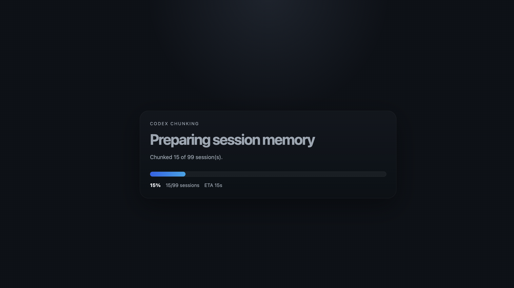
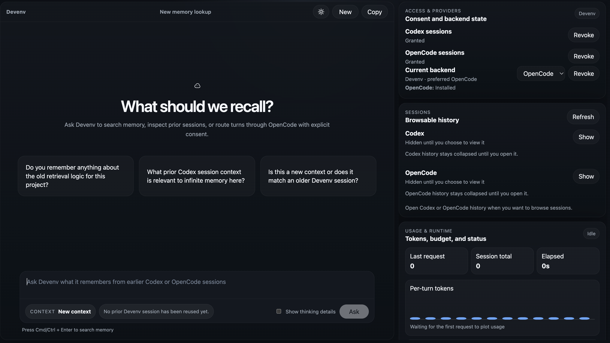
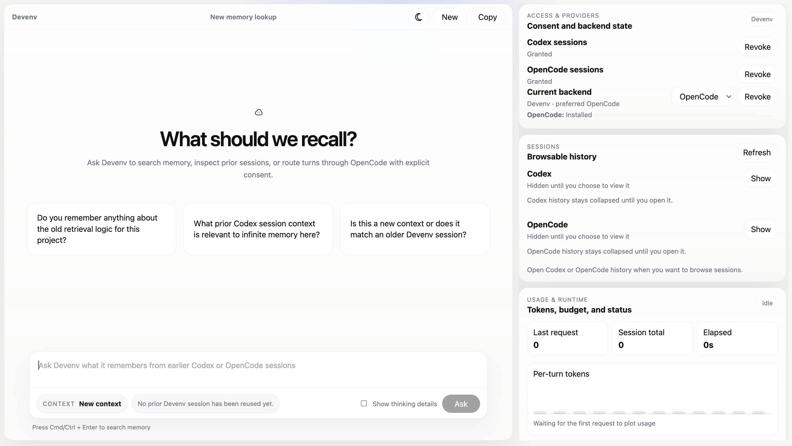

# Devenv AI

Devenv AI is a local-first coding agent foundation for running project-aware workflows on your machine. It combines a runtime layer with a persistent Cognitive Memory Engine (CME) so interactions can build on structured, auditable memory instead of acting like isolated chat sessions.

The project currently ships as an installable Python package and includes:

- a three-pane terminal runtime (TUI) with a retrieval workspace, mode pills, pickers, and an activity log
- a local web runtime
- a one-shot smoke runner for single prompts
- an MCP server for exposing local tools
- a setup/readiness inspector
- a memory engine with working, episodic, and associative memory layers
- a cross-provider retrieval engine that fuses Codex and OpenCode session history with local memory
- a retrieval evaluation harness for scoring recall against a known question set

## Installation

Python 3.12 or newer is required.

Install from PyPI:

```bash
pip install devenv-ai
```

Or with `uv`:

```bash
uv pip install devenv-ai
```

## Quick Start

Point Devenv AI at the folder you want it to work inside.

Devenv's OpenCode integration is server-backed by default. Install the `opencode` CLI and make sure `opencode serve` can run locally; Devenv will connect to the OpenCode HTTP server at `http://127.0.0.1:4096` by default. You can override this with:

```bash
export OPENCODE_MODEL=openrouter/anthropic/claude-sonnet-4
export OPENCODE_SERVER_URL=http://127.0.0.1:4096
export OPENCODE_SERVER_USERNAME=opencode
export OPENCODE_SERVER_PASSWORD=your-password
```

You can also enable Codex as a first-class backend. Codex does not use a CLI subprocess; it connects through the official OpenAI MCP path and Devenv's local MCP HTTP server. Configure it with:

```bash
export OPENAI_API_KEY=your-openai-key
export DEVENV_CODEX_MODEL=your-codex-model
export OPENAI_BASE_URL=https://api.openai.com/v1   # optional
export DEVENV_CODEX_TIMEOUT_SECONDS=60             # optional
```

At runtime, users can choose `opencode`, `ollama`, `llama_cpp`, or `codex` as the backend per session and override it per turn. OpenCode remains the default for backward compatibility, while Ollama and `llama.cpp` are the local on-device options.

### Ollama backend

Devenv can also route turns through a local Ollama instance. The current integration is designed for low-memory local models such as `qwen2.5:3b` and assumes Ollama is already installed on the machine.

Default behavior:

- connects to `http://127.0.0.1:11434`
- discovers installed local models from `GET /api/tags`
- sends chat turns through `POST /api/chat`
- uses streaming HTTP responses internally so the Python backend does not wait for one large buffered reply
- applies bounded runtime options:
  - `num_ctx=4096`
  - `num_thread=half of os.cpu_count()`
  - `keep_alive=2m`

If Ollama is not running, the web health payload, setup checks, footer state, and settings panel all report that explicitly so the user can start it before selecting the backend.

### llama.cpp backend

Devenv can also route turns through a local `llama-server` process from `llama.cpp` by speaking to its OpenAI-compatible HTTP API.

Default behavior:

- connects to `http://127.0.0.1:8080`
- discovers models from `GET /v1/models`
- sends chat turns through `POST /v1/chat/completions`
- respects `DEVENV_LLAMACPP_BASE_URL`, `LLAMA_CPP_BASE_URL`, and `DEVENV_LLAMACPP_MODEL` when set

If `llama.cpp` is not running, the same health and setup surfaces report that explicitly before the backend is selected.

Launch the local web experience:

```bash
cd /path/to/your/project
devenv-web .
```

Then open:

```text
http://127.0.0.1:4173
```

Launch the terminal experience:

```bash
cd /path/to/your/project
devenv-run .
```

Run a single prompt without entering the interactive loop:

```bash
devenv-smoke . "summarize this repository"
```

Start the local MCP tool server:

```bash
devenv-mcp --workspace .
```

Inspect setup and readiness (optionally applying idempotent fixes and warming the local model cache):

```bash
devenv-setup . --include-optional
devenv-setup . --apply --warm-model-cache
```

## Terminal Runtime (TUI)

`devenv-run` launches a Textual-based three-pane workspace instead of a plain prompt loop:

- left sidebar: mode pills, session-source status (Codex / OpenCode), and a live indexing progress bar
- center results pane: retrieved sessions and chunks rendered as result cards
- bottom activity log: color-coded runtime logging with third-party noise suppressed

The TUI currently exposes two modes:

- `retrieve`: ask a question and inspect exactly which prior sessions and chunks are recalled
- `solve`: reserved for the full agent loop and still marked work-in-progress

Useful commands (also available from the command palette via `Ctrl+P` or the footer keys):

- `/retrieve <query>` — retrieve prior sessions and chunks for a query
- `/mode retrieve|solve` — switch modes
- `/enable` — enable all session sources (Codex + OpenCode)
- `/sources` — show session-source status and counts
- `/backend` — open the backend picker or switch with `/backend <name>`
- `/model` — open the model picker or set with `/model [backend] <name>`
- `/permissions` — open the permission picker
- `/status`, `/providers`, `/clear`, `/exit`

Backend and model selections are persisted per workspace. If no session source is enabled, the sidebar prompts `/enable` (or `F3`/`F4`) before indexing begins.

## Retrieval Engine

Devenv builds runtime context from local memory and from prior agent session history, rather than dumping raw transcripts into the model.

- **Fused session recall:** Codex and OpenCode sessions are recalled together and merged, instead of picking a single provider.
- **Chunk-level embeddings:** each session is embedded both whole and as individual chunks (`external_session_embeddings` and `external_session_chunk_embeddings` in `memory.db`), and semantic scoring takes the best chunk match per session, falling back to the whole-session vector.
- **Default embedder:** `sentence-transformers` with `all-MiniLM-L6-v2` (384-dim), cached and probed once, with a deterministic hashing embedder as an offline fallback. Embedding content hashes include the embedder identifier, so switching embedders invalidates and re-embeds stale vectors.
- **Deterministic recall:** provider sessions are deduped so repeat queries return a stable result set, and agent-created/derived sessions are excluded from retrieval by default.
- **Budgeted context selection:** retrieved context lines are scored per session, bounded by a line/char budget, and assembled so the strongest evidence is pinned: the highest-scoring line, the best line from each of the top sessions, and near-top lines are kept even over budget. Giant lines are windowed around the query-matched region rather than dropped. Bounded elimination is on by default and can be toggled with `DEVENV_CONTEXT_ELIMINATION=0`; set `DEVENV_CONTEXT_SHADOW=1` to log what would be dropped without changing behavior.

Re-index prior sessions after large archive changes:

```bash
python scripts/backfill_session_embeddings.py
```

## Retrieval Evaluation

`scripts/retrieval_eval.py` drives the real retrieval engine (index build + `build_runtime_memory_context`) over a 16-question set in `retrieval_eval_questions.md` and scores the output against a ground-truth answer key. The engine only ever sees the question text; the answer key is used purely for scoring, and benchmark-generated meta sessions are excluded so the answers are not pre-leaked.

- Part A (Q1–Q7): niche questions, each hinging on an exact identifier, value, or decision from a single session
- Part B (Q8–Q16): follow-up style "we hit this error, how did we fix it?" questions, each with one primary source session

```bash
python scripts/retrieval_eval.py
python scripts/retrieval_eval.py --elimination on   # compare bounded context selection on/off
```

Results are written to `.devenv/retrieval_eval/results.json` and `.devenv/retrieval_eval/report.md`.

## Screenshots

### Startup chunking



### Web UI, dark theme



### Web UI, light theme



## Installed Commands

After installation, the package exposes these commands:

- `devenv-run`
- `devenv-web`
- `devenv-smoke`
- `devenv-mcp`
- `devenv-setup`

## Version History

### v0.1.6

This release rebuilt the retrieval engine and turned the terminal runtime into a full workspace, while simplifying the web shell.

- Redesigned the terminal runtime into a three-pane Textual TUI: a session-source sidebar with a live indexing bar, a retrieval results pane, and a color-coded activity log.
- Added two-mode TUI flow (`retrieve` now, `solve` in progress), command palette, pickers, per-workspace backend/model persistence, and `/enable` to turn on session sources.
- Fused Codex and OpenCode session recall into one ranked result set instead of picking a single provider.
- Added whole-session and chunk-level session embeddings, with best-chunk similarity scoring for finer semantic recall.
- Defaulted embeddings to `sentence-transformers` (`all-MiniLM-L6-v2`, 384-dim) with a hashing fallback, and made content hashes embedder-aware so switching embedders re-embeds stale vectors.
- Made recall deterministic by deduping provider sessions and excluding agent-created (derived) sessions by default.
- Added budgeted context selection with pinned evidence lines and bounded context elimination (on by default), which shrinks retrieved context without dropping the strongest proof lines.
- Added a 16-question retrieval evaluation harness (`scripts/retrieval_eval.py`) that drives the real engine and scores it against a ground-truth key.
- Simplified the web interface into a chat-first shell and added local visual regression tooling.

### v0.1.5

This release tightened the product surface into a much more polished daily workflow across planning, search, and chat interaction.

- Reworked plan-mode rendering and flowchart validation so plan responses are usable in the UI instead of failing on malformed node payloads.
- Improved retrieval quality and planning behavior so the runtime uses repository context more effectively before answering.
- Added stronger web and knowledge-search flows, including better reference collection and clearer live trace presentation.
- Refined the tool picker, developer workspace rail, and runtime controls to make the web interface denser and easier to use.
- Added working per-message copy and reply actions, plus reply-aware prompt context for follow-up questions.
- Removed broken light-mode chrome and cleaned up several panels to better match the dark-first product direction.

### v0.1.3

This release turned the runtime into a much more usable daily driver and added several of the operational controls that the current web experience depends on.

- Added runtime setup inspection and workspace bootstrap commands.
- Added optional capability reporting for setup, privacy, and health.
- Added performance-mode plumbing for session indexing.
- Added `web_search` as a real runtime tool and improved guidance for web search and large-file handling.
- Added tool-backed prompt generation and exposed it in the web UI.
- Added `no_memory` and `incognito` privacy controls, including a web toggle.
- Improved the live tool trace, tool picker, and web-search feedback in the UI.
- Switched runtime tool execution to the OpenCode-only execution path used at that point in the project.

### v0.1.2

This was mainly a stability and packaging release focused on making fresh-machine installs work more reliably.

- Hardened first-run and fresh-machine setup behavior.
- Tightened the package/release flow around the published install.
- Shipped the `0.1.2` package version bump with setup fixes rather than new product surface area.

### v0.1.1

This was the first release-shaped version of the web/runtime product and packaged the early OpenCode-backed workflow into something publishable.

- Added the web runtime foundations for session browsing, consent controls, and richer turn metadata.
- Added external session indexing and surfaced session/provider rails in the UI.
- Added startup chunking progress and related provider/status displays.
- Taught the OpenCode adapter to emit real tool calls into the runtime.
- Improved replay rendering, markdown display, copy actions, scroll behavior, and live status presentation.
- Wired release publishing to happen from release tags.

## What It Does Today

The current implementation is centered on the Cognitive Memory Engine, a cross-provider retrieval engine, and a small runtime/tooling foundation.

Implemented today:

- bounded working memory for the current task window
- episodic logging for timestamped user and agent interactions
- associative memory storage using hierarchical nodes and graph edges
- semantic retrieval over associative summaries
- spreading-activation style retrieval with parent, sibling, and related-node expansion
- auditable retrieval traces via `get_context_trace()`
- manual memory correction through `forget_node()`
- consolidation flows that can create and update memory nodes from episodic logs
- an injectable architecture for storage, embeddings, vector indexes, and extraction logic
- fused recall across Codex and OpenCode session archives, with whole-session and chunk-level embeddings
- budgeted, evidence-pinned context selection that keeps the strongest lines within a bounded budget
- a 16-question retrieval evaluation harness with a ground-truth answer key

## Memory Engine Example

```python
from core.memory import MemoryEngine

engine = MemoryEngine(db_path="memory.db", vector_dir="vectors")

engine.record_working_memory(
    messages=[{"role": "user", "content": "Fix the Django auth flow"}],
    active_state={"file": "core/memory/engine.py"},
)

engine.update_associative_tree(
    {
        "node_id": "proj_rxgpt",
        "label": "Project: RxGPT",
        "category": "project",
        "summary": "RxGPT uses React, Tailwind, and Django.",
    }
)

engine.add_episodic_log(
    "We introduced a Django auth component.",
    "I'll remember the backend shape.",
    node_id="proj_rxgpt",
    metadata={
        "project": "RxGPT",
        "memory_entities": [
            {
                "node_id": "cmp_django_auth",
                "label": "Django Auth Setup",
                "category": "component",
                "summary": "Django auth relies on session cookies and middleware.",
                "parent_id": "proj_rxgpt",
            }
        ],
    },
)

engine.run_consolidation()
result = engine.retrieve_context("How do I fix my django authentication errors?")

print(result.markdown_context)
print(engine.get_context_trace())
```

## Architecture

The codebase is organized to keep memory logic decoupled from future user interfaces and agent orchestration layers.

Key areas:

- `core.memory`: memory interfaces, storage, retrieval, consolidation, embeddings, and models
- `core.runtime`: terminal runtime, web runtime, MCP server, and runtime orchestration
- `core.tools`: base tool abstractions and local tool implementations
- `core.ai`: OpenCode transport, routing, and model-facing contracts

## How A Message Flows

### Top-level overview

When a user sends a message, Devenv does not immediately hand the whole problem to the model. It first decides what kind of turn this is, gathers just enough local context, chooses the backend, and only then asks the backend to think within Devenv's boundaries.

In the normal path:

1. The runtime receives the user prompt through the terminal or web server.
2. Devenv checks fast local paths first, such as greetings, direct recall answers, or simple follow-ups it can answer without a backend call.
3. If the turn needs context, Devenv gathers memory context from working memory, episodic memory, and optional external session history.
4. Devenv decides whether this is a direct answer turn, a planning turn, or a checkpoint execution turn.
5. Devenv picks the backend the user selected.
   OpenCode remains the default backend and default model is `openrouter/anthropic/claude-sonnet-4`.
6. The backend either:
   asks Devenv to execute a tool call, or
   executes MCP tools directly in the Codex path and returns the executed steps.
7. Devenv records the result, sanitizes the final response, updates memory when appropriate, and returns the answer to the user.

### Proper explanation

#### 1. Entry point and turn setup

The web runtime in `core.runtime.web` or the terminal runtime builds a `DevenvKernel` and calls `execute_turn(...)`.

At the start of a turn, the kernel:

- records basic metadata such as workspace, privacy mode, backend preference, and selected tools
- appends the new user message to ephemeral conversation history
- checks whether the session budget is already exhausted
- forwards backend-access flags into the AI router

This is the point where per-session or per-turn backend choice matters. The router can now direct the turn to either OpenCode or Codex.

#### 2. Fast local answers before retrieval or model work

Before doing any heavier work, the kernel tries several cheap paths:

- greeting handling
- recent follow-up resolution from the current conversation
- tool-strategy questions answered from local rules
- ambiguity checks for underspecified troubleshooting prompts
- exact logged-answer recall for certain memory-style prompts

These paths exist to reduce CPU use and avoid unnecessary backend calls. They also help prevent the model from drifting when Devenv already has the answer locally.

#### 3. Memory and context building

If the turn still needs context, Devenv builds it in layers:

- working memory: the recent in-thread context window
- episodic memory: stored user/assistant interactions
- associative memory: structured summaries and graph-like links
- external session context: optional Codex/OpenCode history archives if access is allowed

The kernel does not dump everything into the backend. It trims and shapes memory depending on the turn type:

- direct turns use a smaller focused memory window
- planning uses a compact planning-oriented memory slice
- checkpoint execution uses task-specific execution memory

This is one of the main places where Devenv stays in charge instead of behaving like a thin chat wrapper.

#### 4. Turn classification

Once context exists, Devenv chooses one of three broad modes:

- direct answer: answer a question, possibly with tools
- planning: create a bounded checklist/blueprint
- execution: work one checkpoint at a time and verify it

The runtime state machine in `core.runtime.kernel` tracks those stages explicitly, including planning, executing, and verifying.

#### 5. Backend routing

Routing lives in `core.ai.routing`.

Today the router can send turns to:

- OpenCode
- Codex

OpenCode path:

- uses OpenCode server sessions
- reuses a backend session across the Devenv conversation
- returns either a final answer or a Devenv tool request

Codex path:

- uses the official OpenAI MCP integration path
- connects to Devenv's local MCP HTTP server
- returns a final answer plus any already-executed MCP tool steps

Devenv does not silently switch to the other backend when the user explicitly chose one. It reports the failure clearly instead.

#### 6. Tool execution model

There are two tool-execution styles now.

OpenCode style:

- OpenCode selects a tool from the bounded tool list
- Devenv validates the request
- Devenv executes the tool itself through the runtime tool client
- the tool result is fed back into the next backend turn

Codex style:

- Codex talks to Devenv's MCP HTTP server directly
- only the filtered, allowed tools are exposed for that turn
- Codex executes tools through MCP
- the backend returns executed tool steps back to Devenv for tracing and auditing

Even in the Codex path, Devenv still owns the tool surface because Devenv decides which tools are exposed, how path sandboxing works, and which write/delete actions are allowed.

#### 7. Planning and checkpoint execution

For work that is not a simple direct answer, Devenv creates an execution blueprint made of checkpoints.

Planning phase:

- the backend is asked for a bounded checklist-style plan
- planning tool scope stays restricted
- non-planning tools are blocked

Execution phase:

- Devenv activates one checkpoint at a time
- builds task-specific context
- exposes only the tools appropriate for that checkpoint
- enforces single-step or bounded-step behavior depending on the path

Verification phase:

- Devenv verifies the resulting artifact or workspace state
- failed verification can split or repair checkpoints instead of pretending the work is done

This checkpoint architecture is what keeps the runtime closer to an agent than a plain chat UI.

#### 8. Sanitization, memory persistence, and response delivery

After the backend finishes, Devenv:

- merges token usage into session totals
- sanitizes noisy or replayed answer text
- compacts the conversation history
- records working memory
- persists episodic memory only for high-signal responses

That last rule matters because low-signal fallback answers and noisy transcript dumps can pollute later retrieval if they are stored carelessly.

Finally, the runtime returns a `RuntimeTurnResult` containing:

- the final response
- tool execution steps
- usage
- metadata
- verification state
- error information when relevant

That result is what the web UI and terminal renderer display back to the user.

### Runtime architecture

Devenv keeps control of planning, memory retrieval, verification, transcript persistence, and tool execution. Users can choose between four backends:

- OpenCode: server-backed session transport with default model `openrouter/anthropic/claude-sonnet-4`
- Ollama: local HTTP transport with discovered installed models such as `qwen2.5:3b`
- llama.cpp: local OpenAI-compatible HTTP transport against `llama-server`
- Codex: official OpenAI MCP integration against Devenv's local MCP HTTP server

Behavioral rules:

- Devenv talks to OpenCode through a Python HTTP client instead of scraping `opencode run` output
- Devenv talks to Ollama through the local HTTP API and applies bounded runtime options for context size, thread count, and keep-alive
- Devenv talks to `llama.cpp` through the local OpenAI-compatible HTTP API exposed by `llama-server`
- Codex uses the official OpenAI MCP path and the Devenv MCP HTTP server rather than a CLI subprocess
- OpenCode sessions are reused across a Devenv conversation and reset when a new thread starts
- runtime tool execution uses an in-process transport by default to avoid extra MCP subprocess overhead; set `DEVENV_TOOL_TRANSPORT=mcp` if you explicitly want the stdio MCP hop
- explicit backend selection does not silently fall back to the other backend
- the legacy OpenCode CLI parser is available only as an emergency fallback when `DEVENV_OPENCODE_USE_LEGACY_CLI=1`

Main public memory entry point:

```python
from core.memory import MemoryEngine
```

Core memory responsibilities include:

- `record_working_memory(messages, active_state)`
- `add_episodic_log(user_prompt, agent_response, node_id=None, metadata=None)`
- `update_associative_tree(node_data)`
- `retrieve_context(current_prompt, top_k=5)`
- `run_consolidation(since=None)`
- `forget_node(node_id, strategy="prune")`
- `get_context_trace()`

## Development Setup

For local development:

```bash
python3 -m venv .venv
source .venv/bin/activate
python -m pip install -U pip
python -m pip install -e .
```

The runtime stack expects local availability of:

- `lancedb`
- `sentence-transformers`
- `textual`
- `mcp[cli]`

The default embedder model (`all-MiniLM-L6-v2`) is cached locally and loaded offline once present. Run `devenv-setup . --warm-model-cache` to download it up front.

## Testing

Run the current test suite with:

```bash
python3 -m unittest discover -s tests -p 'test_*.py'
```

The current suite covers memory imports, persistence, retrieval behavior, vector ranking, manual correction, and consolidation flows, plus runtime coverage for the kernel, context builder, web runtime, MCP server, and TUI.

## Current Scope

This repository is still an early foundation, not a full end-user coding product.

Working today:

- the terminal TUI `retrieve` mode and the web runtime
- cross-provider session retrieval and the evaluation harness

Not implemented yet:

- the TUI `solve` mode (full agent loop in the terminal)
- an always-on inactivity scheduler for consolidation
- cross-device sync
- multi-repo memory sharing
- a fully verified end-to-end agent orchestration loop
- a secure remote execution layer

## License

This project is licensed under the MIT License. See [LICENSE](/Users/samarthnaik/Desktop/Projects/devenv/LICENSE:1).
